# Voxel Gen Tools for 3D Visualization in Blender

Blender 4.3+ add-on to convert 3D image stacks into models. Converts binary arrays into colormapped structures representing quantitative parameters or datasets. Built to analyze variations and patterns for segmented imaging data.

### Citation 

Read our preprint, accepted to Structure (Cell Press), [here](https://pmc.ncbi.nlm.nih.gov/articles/PMC12458229/).

```
Chang K, Deshmukh A, Verma R, Loconte V, White KL. Classifying Biophysical Subpopulations of Insulin Secretory Granules using Quantitative Whole Cell Structure Analysis. bioRxiv [Preprint]. 2025 Sep 15:2025.09.09.675239. doi: 10.1101/2025.09.09.675239. PMID: 41000628; PMCID: PMC12458229.
```

<p align="middle"> 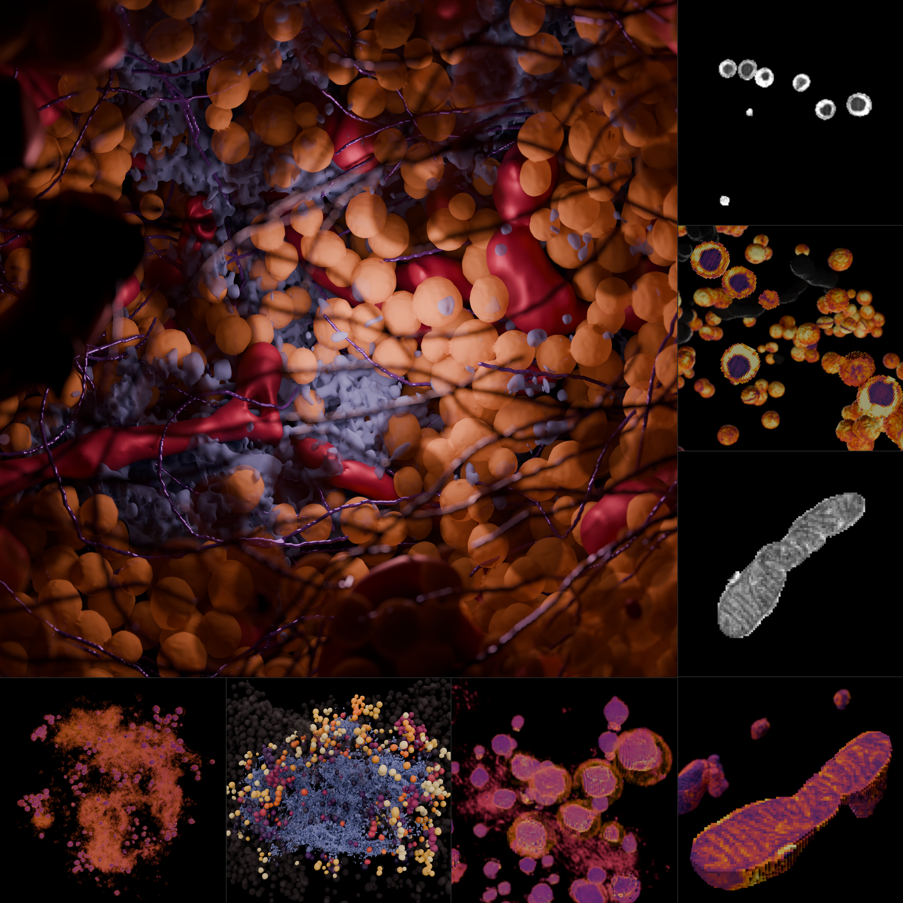 </p>  

### Contents
- [Overview and Key Features](#overview)  
- [Examples Renders across Modalities](#example-renders)
- [Installation and Usage Guidelines](#installation-and-usage)
- [Data Requirement and Code Description](#data-requirements)

### Overview

This Blender add-on is a plus for 3D microscopy visualization, and suits a wide variety of imaging modalities (previously tested with FIB-SEM, Cryo-ET, and SXT)! Convert your segmentation masks and parametrized data into colorful 3D models that provide both *qualitative* and *quantitative* visual patterns.  

*Key Features*
- Complete pipeline from voxel generation to smoothing and subdivision.
- Built-in material generator optimized to utilize scientific colormaps.
- Base code for data preparation and file conversion.
No prior Blender experience is required, and YouTube and StackExchange are ever-present helpers.

---

# Example Renders

The images below highlight key renders generated with the various tools provided in this add-on package.

## Soft X-Ray Tomography (SXT)
> This data is well-analyzed, quantified, and published throughout our research.

## Focused Ion Beam Scanning Electron Microscopy (FIB-SEM)
> This data was obtained from [BetaSeg](https://betaseg.github.io/).
<p align="middle">  </p>  

## Cryo Electron Tomography (Cryo-ET)
> This data is novel and preliminary, with analysis currently underway.

---

# Installation and Usage

This information is also available in document and video form under [tutorials_documentation](tutorials_documentation).

## Step 0: Installation of the Voxel Tools Add-on

> Download the .zip package from this repository. Extract the contents and locate the add-on file in **voxel-gen-tools-for-blender > add_on_code > add_on_voxel_tools.py**.

> Download Blender’s latest version from their website and follow the package installation steps. Open a new General file. The previous contents can be deleted through **A > Delete**.

<p align="middle"> 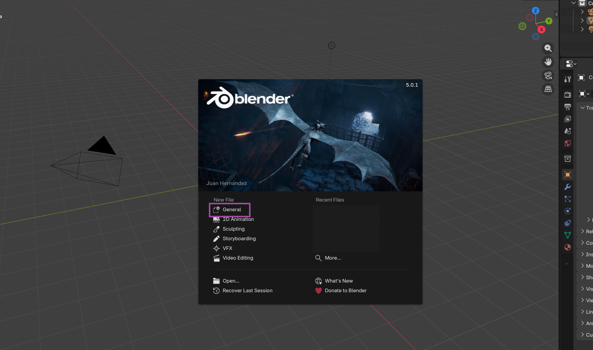 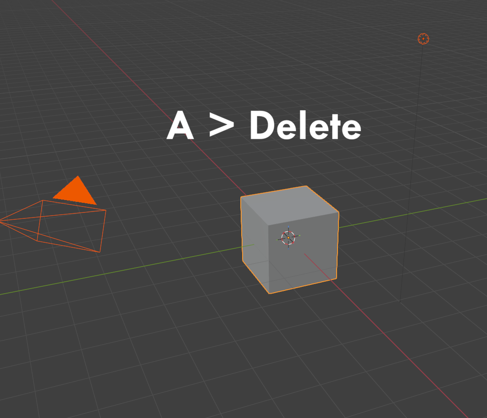 </p>  

Go to **Edit > Preferences > Add-ons** and locate the top right button: Add-ons Settings. Click and select Refresh Local, then Install from Disk… Select the .py file found earlier in the extracted .zip. The add-on will pop up and be pre-selected in the list.

<p align="middle"> 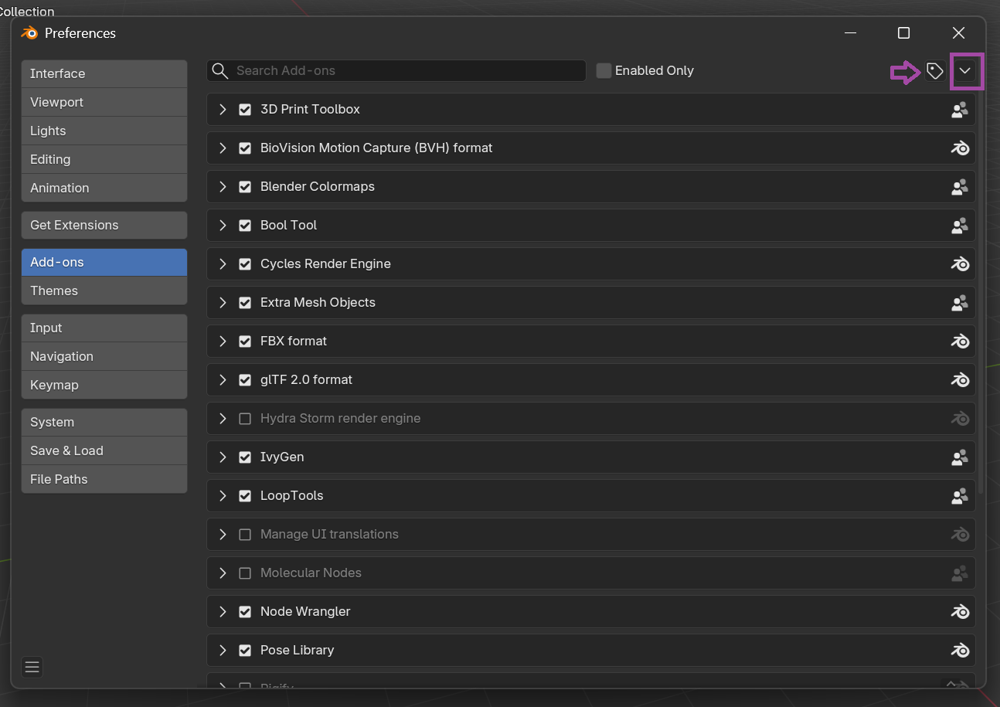 </p>  
<p align="middle"> 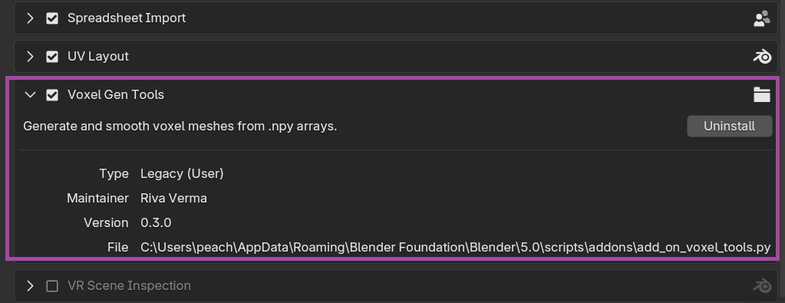 </p>  

On the blank screen, click **N** to open the Sidebar. The Voxel Gen Tools tab will appear last. 

<p align="middle"> 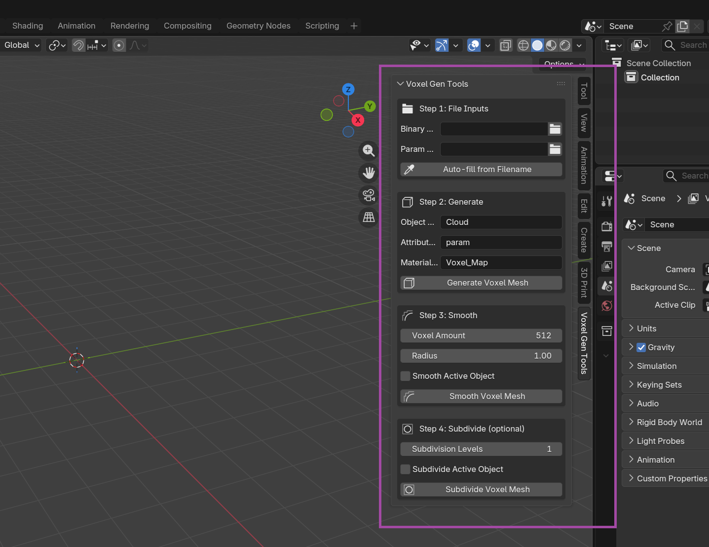 </p>  

## Step 1: Environment Setup

Before a mesh may be generated, the environment’s unit system must be set up. With the Sidebar open (N), select the tab **View > Clip Start > End**, then add 000 to the end to set it to **1000000 m**. This is due to the large mesh size.

<p align="middle"> 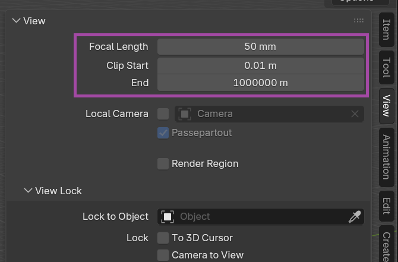 </p>  

Add a camera to the scene by clicking **Shift + A > Camera**. The actual focus can be adjusted later. On the right side of the screen, click on the green camera icon, and adjusted clip end to the same value as the environment (1000000). 

<p align="middle"> 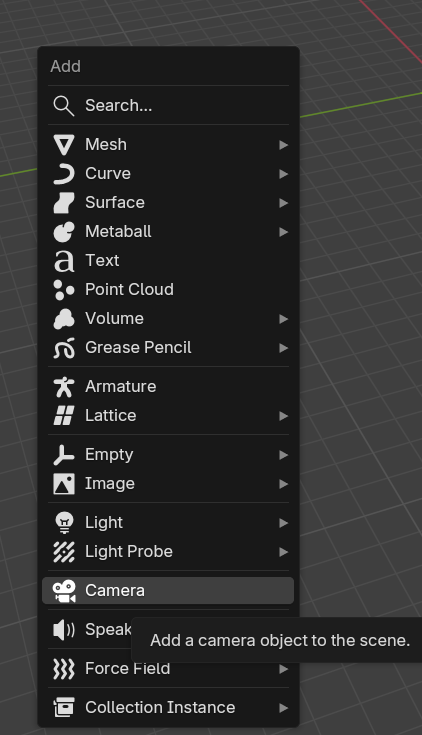 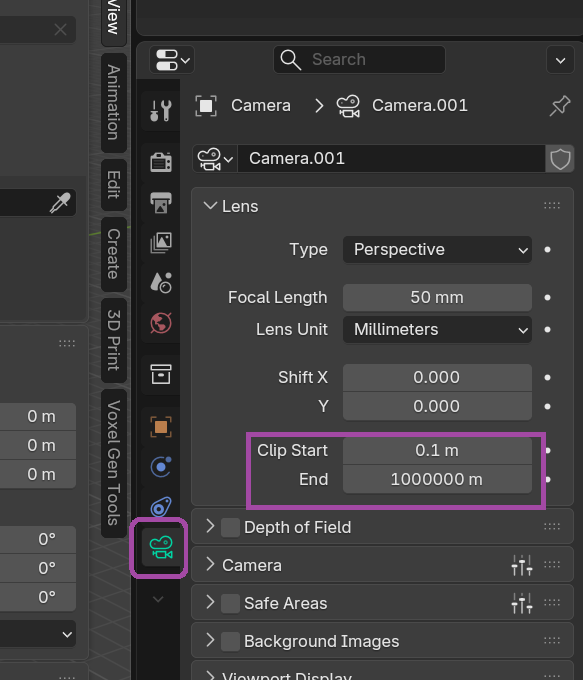 </p>  

Add basic lighting to the scene through **Shift + A > Light > Sun**. Again, on the right side of the screen, click the green light bulb symbol, then change Strength to **5** and Angle to **180 deg**. These values can be manipulated for more control and effect. 

<p align="middle"> 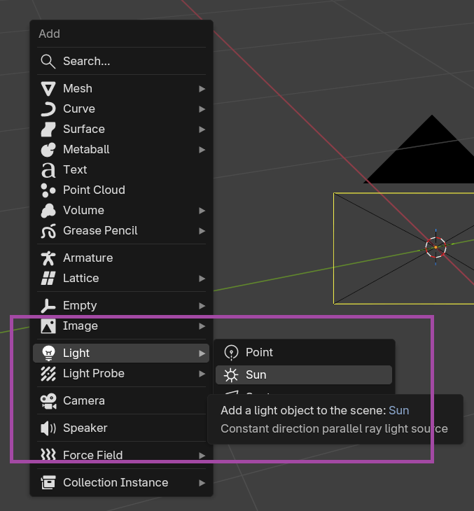 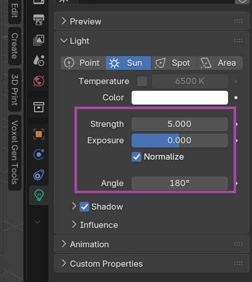 </p>  

Finally, for basic render settings, go to the Render properties tab. To start, for simplicity, use the **EEVEE Engine**. Under the **Film** tab, toggle **Transparent** to create a background-less render. This allows for control over the effect of backdrop lightning and color.

<p align="middle"> 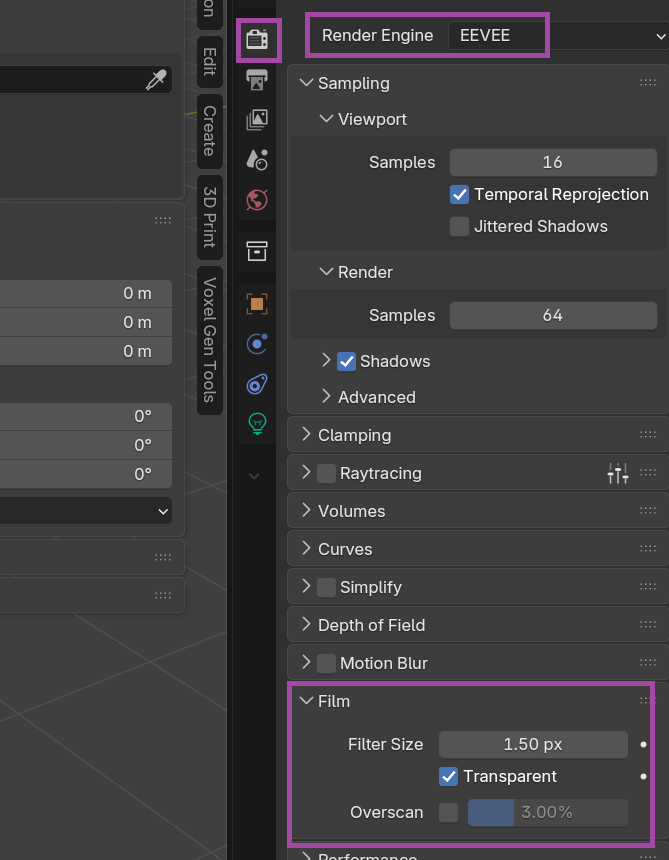 </p>  

The next tab allows you to adjust the frame size. Personal preferences are a square screen size of 5120x5120. 

<p align="middle"> 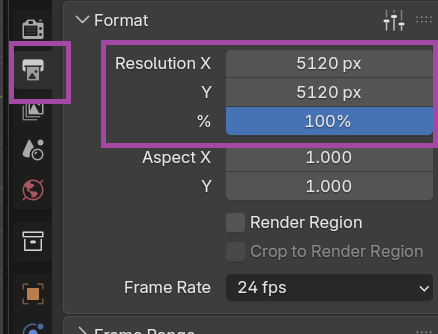 </p>  

> Blender videos and forums can provide basic starting points for lighting, materials, and camera adjustments to suit the rendering needs.

## Step 2: .npy Files and Inputs

> Refer to the Data Requirements section for details on input files compatible with the current version. Sample code and test data have been provided as well.

The add-on requires 2 input files, both in the .npy array format: 

<p align="middle"> 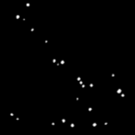 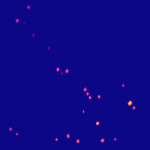 </p>  

1.	**Binary Mask**: a black-or-white mask of the objects present. For example, a segmentation mask of the mitochondria in a cell.

2.	**Param Mask**: a grayscale mask of the same shape as the binary mask, which overlays the objects with pre-calculated parameters. For example, the curvature of mitochondria at each vertex.

<p align="middle"> 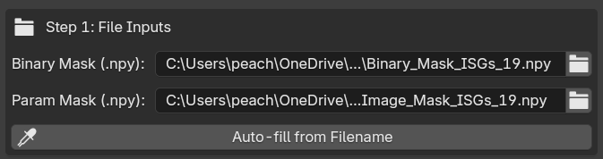 </p>  
 
The **Auto-fill from Filename** button populates the next step with the saved information in the selected file’s name.

## Step 3: Generating a Point Cloud Voxel Mesh

> This step creates the voxel mesh by inserting a single vertex at each pixel location (x, y, z) in the 3D slice. Through Geometry Nodes, a unit square is generated at each vertex. The point cloud is also assigned a Vertex Group, which essentially assigns each vertex a color based on the param.npy values, and the unit square is colored the same way.

Once the files are selected and auto-fill is clicked, the add-on will assign an **Object Name** to the mesh, an **Attribute Name** to the vertex group, and a **Material Name** to the shader/color map. To create the mesh group, click on the **Generate Voxel Mesh** button. This step may take a few minutes to process. You might need to zoom out a little for the mesh to come into view due to the size (each unit square is 1x1x1 m).

<p align="middle"> 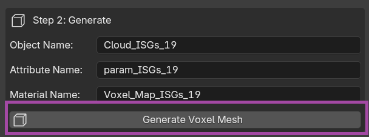 </p>  

## Step 4: Coloring by Value and Colormap 

Hit N to hide the sidebar (or show it) if required. Click on the **Viewport Shading: Material Preview** tab in the top right corner to display a grayscale mesh. 

<p align="middle"> 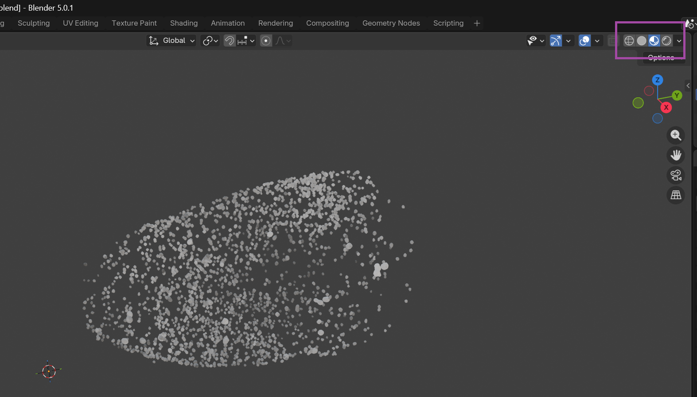 </p>
 
On the lower half of the screen, switch the Timeline to the **Shader Editor** from the corner menu button. Make sure to click on the mesh to highlight the active shader and object. Click and drag the boxes in the shader editor to rearrange. The **Color Ramp** node controls the colormap.

<p align="middle"> 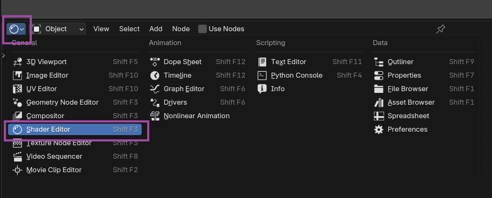 </p>
<p align="middle"> 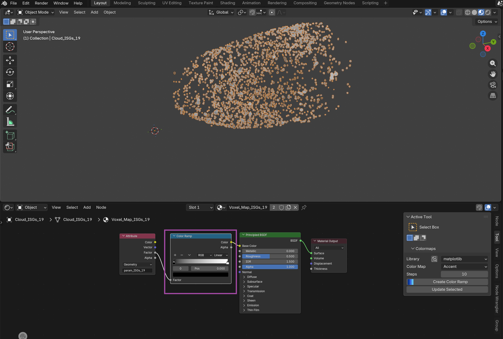 </p>
 
The next step requires [**Blender Colormaps**](https://github.com/TheJeran/Blender-Colormaps). Download the .zip file and follow the installation steps. Without this add-on, you may have to recreate the colormaps from scratch. 

<p align="middle"> 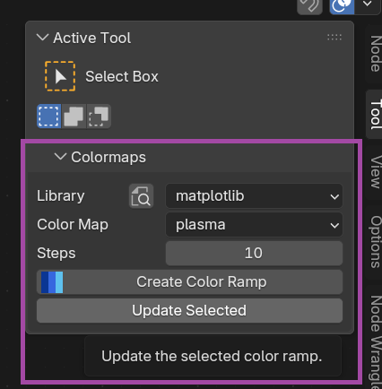 </p>
 
To change the colormap, click on the Color Ramp node, and navigate to the Sidebar (N) in the shader editor. Under Tool, select the desired library and colormap, and click **Update Selected**. The mesh should now appear colored. 
 
<p align="middle"> 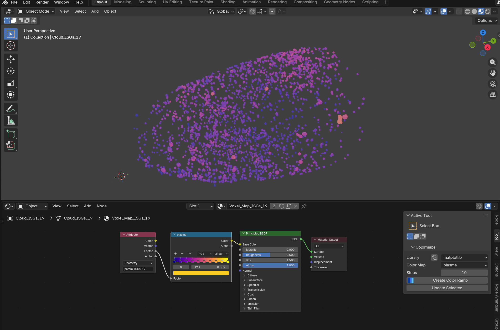 </p>

## Step 5: Smoothening and Subdivision

> This step ‘smoothens’ the voxelated mesh by triangulating the vertices of the point cloud and assigning the new vertices the color of the nearest voxel in the original mesh. This way, the new color location may not be exact, but qualitatively represents variations while providing a clean look. 

In the main Sidebar (N), location **Step 3: Smooth**. If the name of the object point cloud hasn’t been changed, the add-on will automatically smoothen the latest generated mesh. For more control or if the mesh has been renamed, select **Smooth Active Object**. This will apply the triangulation modifier to the highlighted object. 

<p align="middle"> 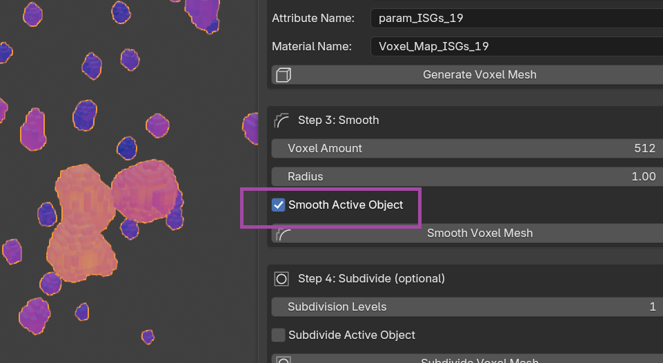 </p>
 
Click **Smooth Voxel Mesh** to generate a new mesh with triangulation. The original point cloud is preserved. 

<p align="middle"> 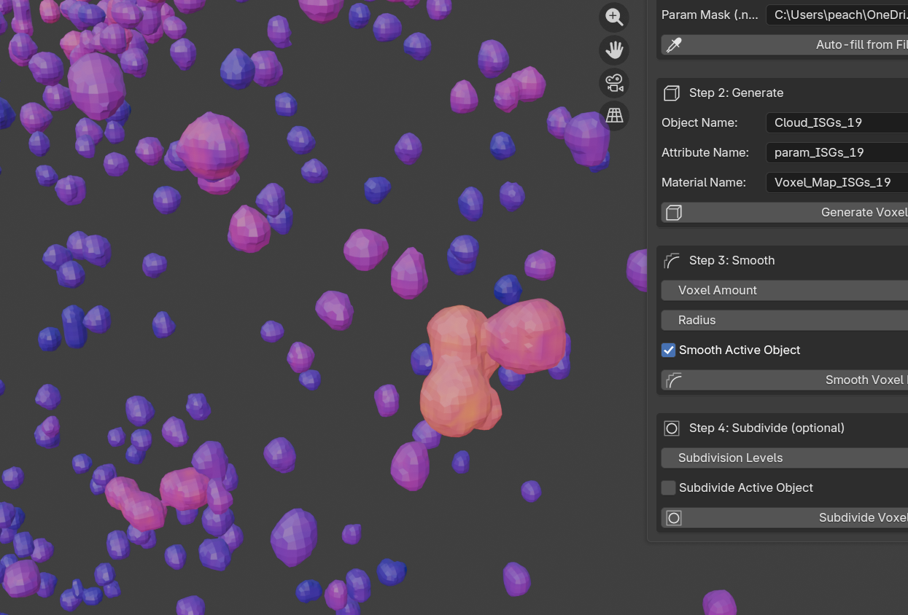 </p>
 
**Step 4: Subdivide** is optional since this step just smoothens the mesh further by adding more vertices, and requires a significant amount of processing power. The default settings work best on smaller, lower resolution meshes (SXT > ET). The same rules as smoothening apply for **Subdivide Active Object**. 

<p align="middle"> 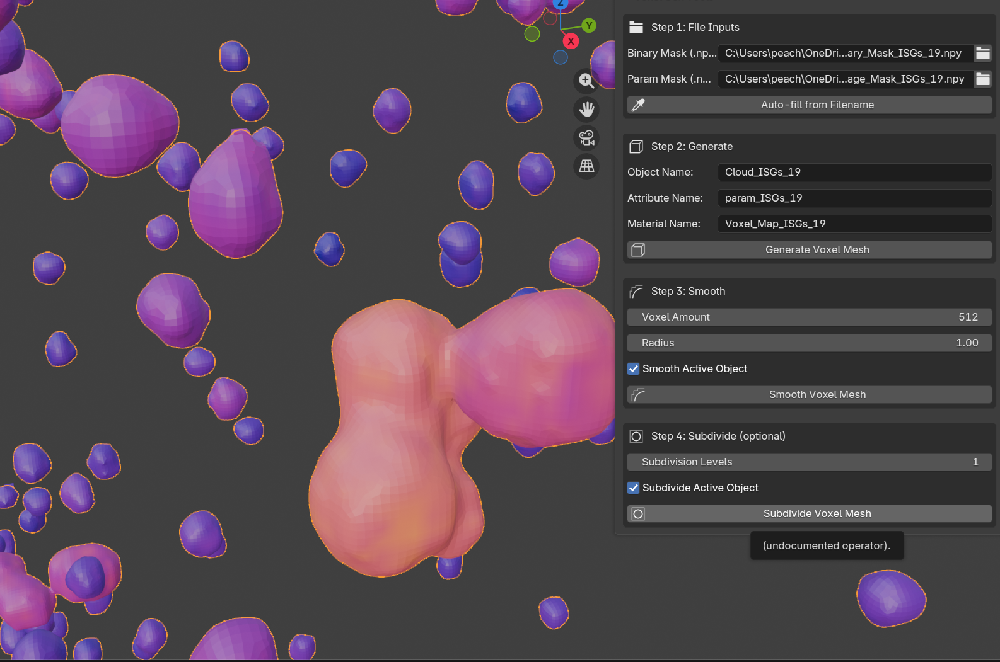 </p>
 
Finally, right-click and select **Shade Smooth** for a finished mesh. 

<p align="middle"> 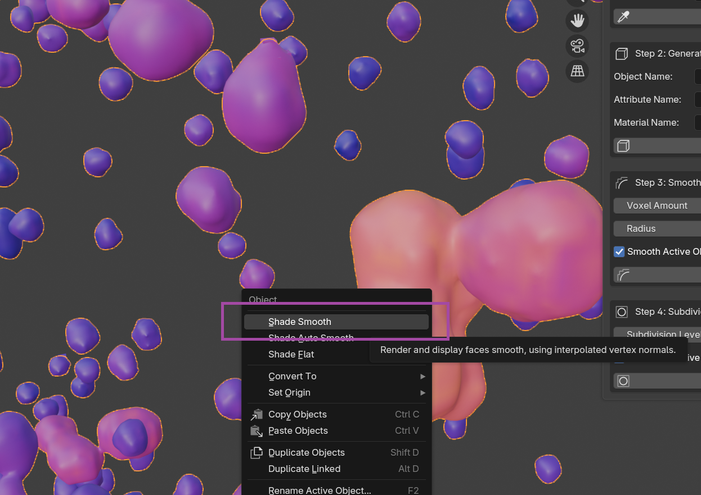 </p>

## Step 6: Setting up the Render

> This final step involves setting up the lightning and camera for a basic render of the generated mesh. 

The shortcut to **Camera View is 0** on the numpad. If your device does not have a numpad, you can set the regular numerical keyboard to act as a numpad in Blender. The current camera view is probably empty, so use the axes to set your desired angle. The numpad keys jump to front, side, and top view for the xyz planes. Press **Ctrl + Alt + 0** to automatically move the camera to match your frame. 

<p align="middle"> 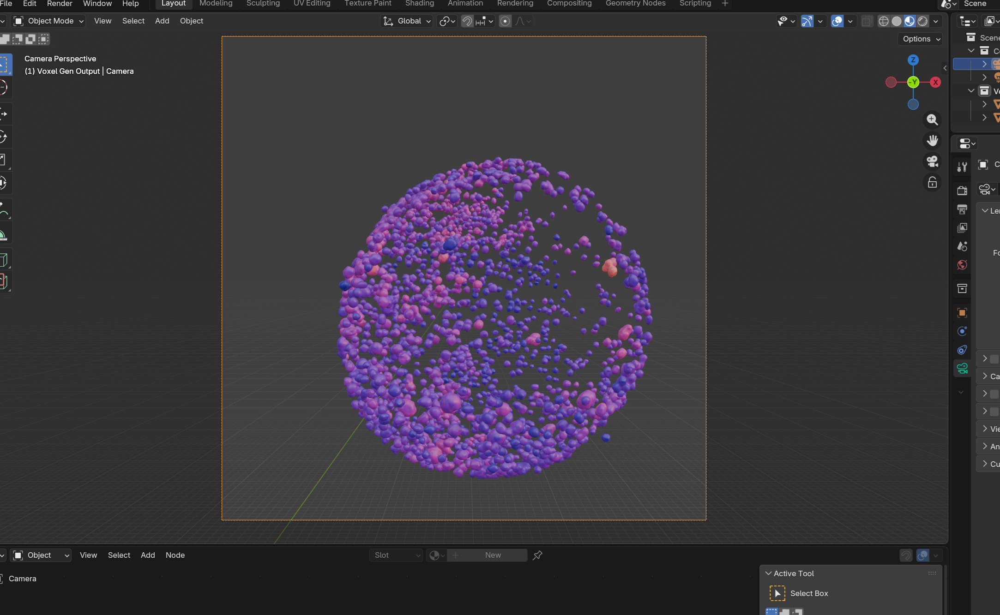 </p>
  
Under the green camera icon, select **Lens > Orthographic** from the dropdown for a different projection style. Use the Scale arrows to zoom in and out accordingly. Ensure that the camera frame is highlighted, and press **G** and drag your mouse to move the object within the frame. Click to confirm. 

<p align="middle"> 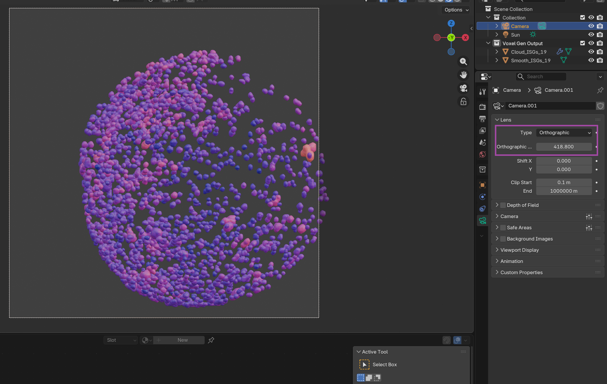 </p>
<p align="middle"> 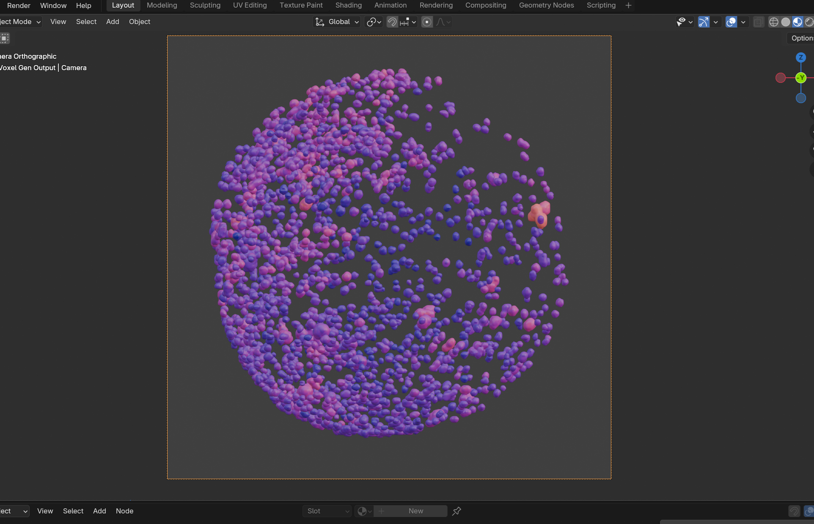 </p>
 
In the top right corner, select **Viewport Shading: Rendered** to see the effect of lighting. Select the Sun in the Scene Collection, top right, to manipulate position and angle. Since the Sun is ‘universal’, the position will not change the lighting. Click **R** to rotate and change its angle along the axes to find the optimal direction. For example, **R > X** rotates the sun about the x-axis. Click or press enter to confirm. 

<p align="middle"> 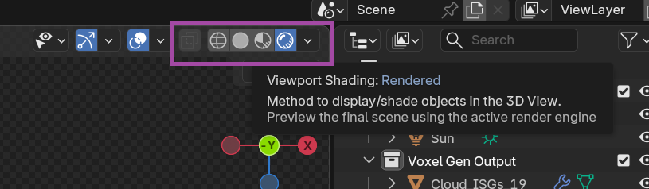 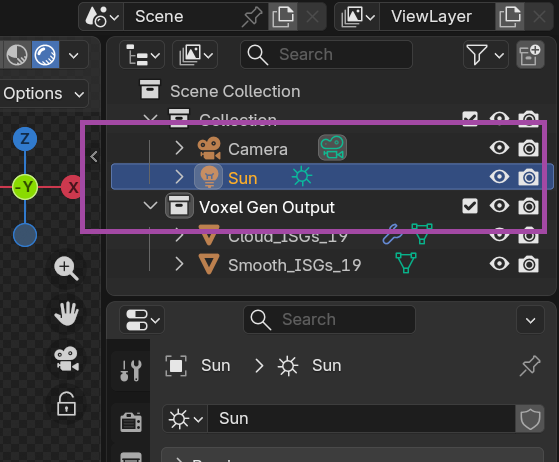 </p>
  
To render the image, go to **Render > Render Image** on the top left. Since we’re using the EEVEE engine, renders will be quite fast. 

<p align="middle"> 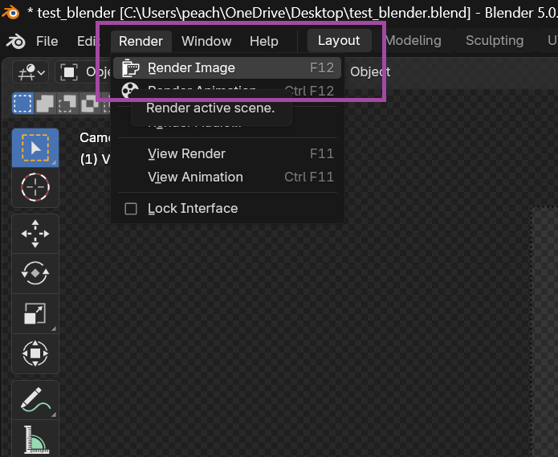 </p>
<p align="middle"> 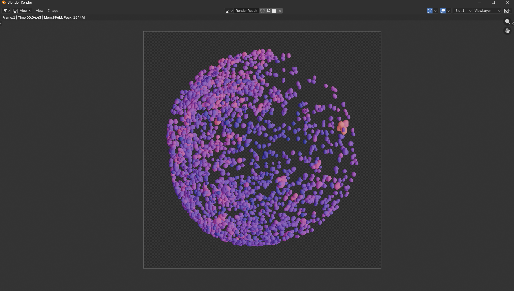 </p>
 
**That’s it for a basic render with this tool! Make sure to keep saving and cite our work :)**

> *Expected Updates and Future Versions:*
> *-	Cartoon Shader for ‘Flat’ 3D Renders*
> *-	Standardized NPY generator for all segmented data types*
> *-	Pre-Blender Data Setup GUI for NPYs and STLs*

---

# Data Requirements 

### File Formats

For our NPY generator code, any raw image file with the .mrc or .tif extension may be used, and the function automatically detects the type.

### Array Shapes and Type

For best results, ensure the shapes of both the binary and param masks match so the results are precisely overlaid. 

> - The binary array should be 3D (Z, Y, X) int or uint8 type, with background values set to 0. 
> - The param array should be float32, with values normalized to a range of [0, 1]. Here, too, background voxels should be 0. 

### NPY Scripts Description

> - **mrc_2_stl**: converts a binary segmentation mask of a 3D image stack into a triangulated mesh with the .stl extension for direct import into any 3D modeling software.

> - **csv_2_json**: converts data from CSV to JSON format for use in the npy generation functions (currently specific to our data but can be used as a map for other datasets).

> - **image_2_npy**: maps the raw grayscale values of the original image onto the segmentation mask only where the desired objects are present.

> - **continuous_2_npy**: finds individual objects within the binary segmentation mask and assigns pre-calculated values within a continuous range normalized from 0 to 1 to those objects from the JSON. 

> - **discrete_2_npy**: assigns discrete, integer-based binary or multiple group numbers to individual objects as extracted from the analysis JSON, usually for clusters or Booleans. 

Each npy generator will output both a binary mask and a param mask for import to the Blender add-on. The image_2_npy function should work for most raw images and segmented masks. The continuous and discrete functions are currently specific to our data but may be used as a baseline for other similar parametric datasets. Please go over all the set constants and inputs for these code functions before use. Test data is provided to ensure the base code functions as intended. 
